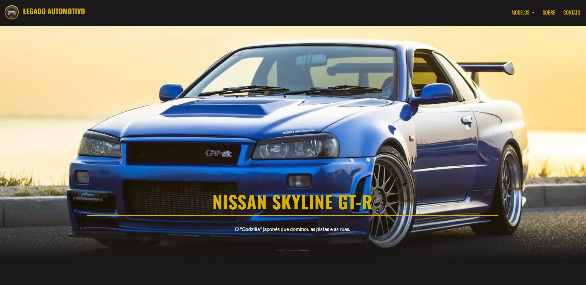
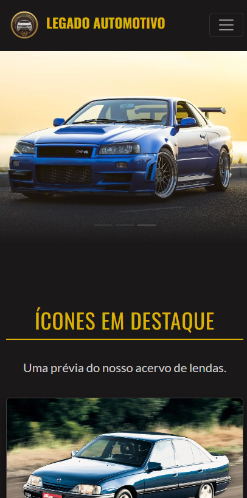
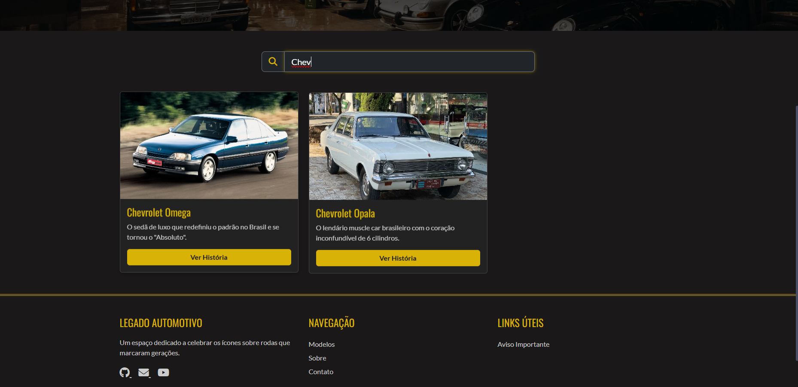

<h1 align="center"> Legado Automotivo (Versão Bootstrap)</h1>

<p align="center">
  
  
  
  
  <a href="https://projeto-legado-automotivo-bootstrap.vercel.app">
    
  </a>
</p>

<p align="center">
  <strong>Uma plataforma moderna para entusiastas, combinando a robustez do Bootstrap com identidade visual única.</strong>
</p>

---

##  Preview do Projeto

<div align="center">
  
</div>

<br>

>  **Acesse Online Agora:** [projeto-legado-automotivo-bootstrap.vercel.app](https://projeto-legado-automotivo-bootstrap.vercel.app)

---

##  O Conceito: "Chassi Bootstrap, Pintura Autoral"

Este projeto nasceu de um desafio acadêmico: **dominar o Bootstrap sem ficar refém do design padrão dele.**
Como entusiasta automotivo (dono de um **Omega CD 4.1**), sei que a estrutura importa tanto quanto o visual. Por isso, a arquitetura foi pensada em duas camadas:

1.  **O Chassi (Estrutura):** Uso dos componentes robustos do Bootstrap (Grid, Navbar, Carousel) para garantir responsividade total e performance.
2.  **A Pintura (Identidade):** Uma camada de CSS personalizado (`style.css`) que sobrescreve as variáveis padrão, criando uma identidade visual única e "custom" para o Legado Automotivo.

>  **Evolução:** Esta é a refatoração da [Versão Vanilla (CSS Puro)](https://github.com/GabrielSSegatto/Projeto-legado-automotivo). A migração focou em agilidade de desenvolvimento e padronização de UI.

---

## 📸 Galeria de Funcionalidades

| 📱 Responsividade Mobile | 🔍 Filtro em Tempo Real |
| :---: | :---: |
|  |  |
| *Layout adaptável para qualquer tela (Grid System)* | *Busca instantânea de modelos via JavaScript* |

---

##  Detalhes Técnicos

### Componentes & Override
* **Grid System:** Uso intensivo de `.container`, `.row`, e `.col-*` para layout fluído.
* **Navegação:** Navbar responsiva com `.navbar-toggler` e dropdowns funcionais.
* **Interatividade:** Carrosséis (Hero e Depoimentos) e Accordions para FAQ/Informações.

### JavaScript (Vanilla JS)
O projeto não depende apenas do JS do Bootstrap. Foram implementadas lógicas customizadas:
* **Filtro de Busca:** Manipulação do DOM para filtrar cards de carros em tempo real.
* **UX Avançada:** Controle do carrossel via teclado (setas/WASD).
* **Performance:** Uso de `Intersection Observer` para só ativar os eventos de teclado quando o carrossel está visível na tela.
* **SessionStorage:** Sistema de aviso inicial (Toast) que não incomoda o usuário em visitas recorrentes.

---

## Como Executar Localmente

```bash
# Clone este repositório
git clone [https://github.com/GabrielSSegatto/Projeto-legado-automotivo-Bootstrap.git](https://github.com/GabrielSSegatto/Projeto-legado-automotivo-Bootstrap.git)

# Entre na pasta
cd Projeto-legado-automotivo-Bootstrap

# Abra o index.html (Sugestão: Use o Live Server do VSCode)